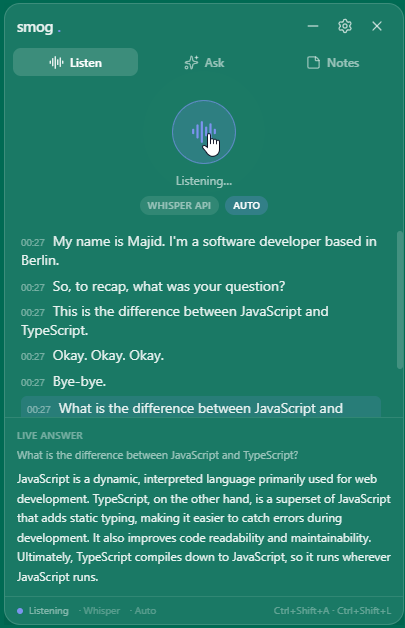
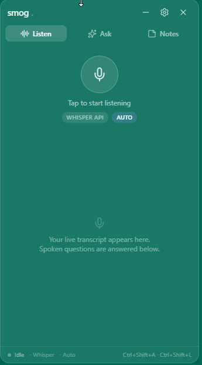
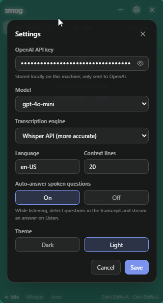

# smog — AI Meeting & Interview Copilot

Free, open-source overlay: live transcription, instant answers, and notes. Bring your own OpenAI key. Licensed under [MIT](LICENSE).

1. **`desktop/`** — Electron overlay: a translucent, always-on-top panel that transcribes audio, answers spoken or typed questions, and generates notes.
2. **`web/`** — Next.js landing page for the same product.

> **Positioning.** A local live copilot (meetings, practice, captioning, language learning). The overlay is a UX feature. Deliberately **out of scope**: hidden-from-capture / “undetectable” mechanics, hosted tokens, and paid plans.

## Screenshots

Spoken questions are detected in the transcript and answered on Listen.



Tap the mic to start. Whisper or Web Speech; auto-answer can stay on.



Paste your OpenAI key in Settings. It stays on this machine.



---

## Prerequisites

- **Node.js 18+** and **npm** (developed on Node 22 / npm 10).
- Internet access (for `npm install` and the OpenAI API).
- An **OpenAI API key** — required for **Ask**, auto-answer, **Notes**, and **Whisper**. The **Web Speech** engine works with no key.

---

## Desktop app (`desktop/`)

```bash
cd desktop
npm install
npm run dev
```

A translucent overlay appears (top-right). On first launch, paste your OpenAI API key in the window. It is stored locally and only sent to OpenAI.

### Modules
- **Listen** — live transcription. Spoken questions can auto-answer on this tab.
  - **Web Speech API** (default) — real-time, no key.
  - **Whisper API** — more accurate, requires key.
- **Ask** — type a question (recent transcript is attached as context); the answer streams in.
- **Notes** — generate structured Markdown notes from the transcript; edit and export to `.md`.

### Global shortcuts (defaults)
| Action | Shortcut |
| --- | --- |
| Show / hide overlay | `Ctrl+Shift+Space` |
| Push-to-Ask (show + focus Ask) | `Ctrl+Shift+A` |
| Start / stop listening | `Ctrl+Shift+L` |

(Use `Cmd` instead of `Ctrl` on macOS.)

### Notes on transcription engines
- **Web Speech API** runs in Chromium and usually works with no setup. If it errors (`network` / `service-not-allowed`), switch to **Whisper** in Settings — that engine uses your OpenAI key.

---

## Landing page (`web/`)

```bash
cd web
npm install
npm run dev
```

Open the printed local URL to view the site.

---

## Tech stack
- **Desktop:** Electron + electron-vite + React + TypeScript + Tailwind CSS v3.
- **Web:** Next.js (App Router) + TypeScript + Tailwind + shadcn/ui + lucide-react.

## Responsible use
Use it ethically — e.g., as a personal accessibility, captioning, or note-taking assistant. Settings (including your API key) are stored locally and never leave your machine except as direct calls to OpenAI.
